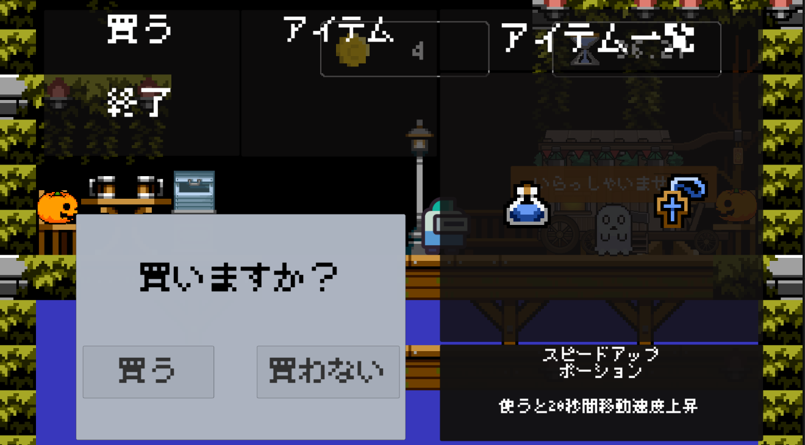
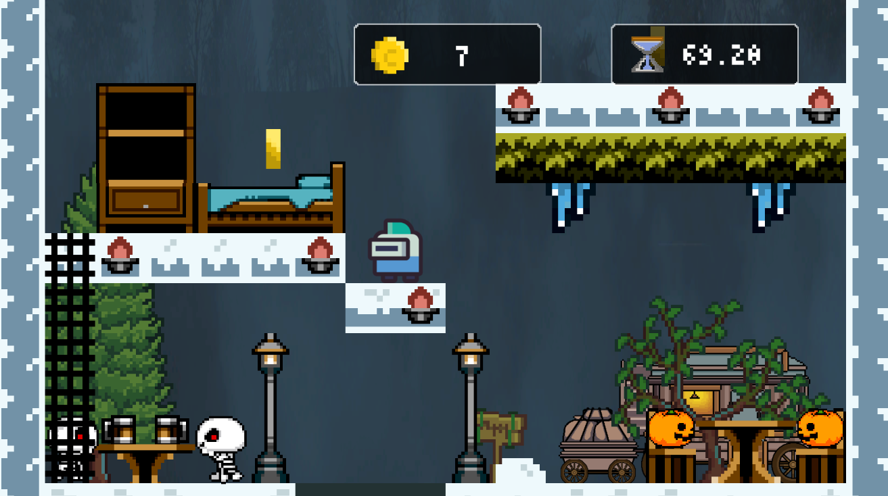
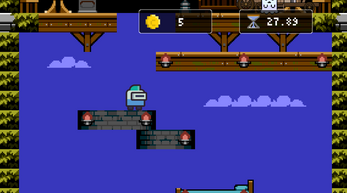
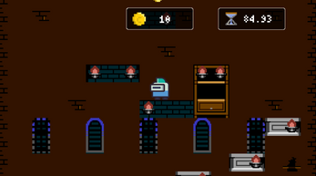
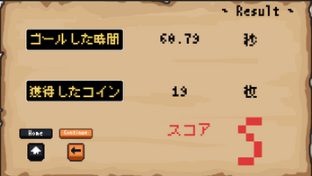

# SuperJump

**SuperJump** は、プレイヤーのジャンプ操作を軸にしたシンプルかつスリリングなアクションゲームです。
---

## 🎮 プレイ方法

### ▶ Unityroomでプレイ（ブラウザ対応）
[Unityroomでプレイする](https://unityroom.com/games/superjump)

### 💾 ダウンロード版（Windows向け）
[itch.ioからダウンロード](https://yotya.itch.io/superjump)

## 🛠️ 開発環境

- Unity
- C#
- Unityroom投稿形式
- Itch.io配布対応

---

## ✏️ 操作方法
- ← / →キー または A / Dキー：移動
- スペースキー：ジャンプ
- その他の操作：ゲーム内の説明をご覧ください

---

## 🔗 作者情報

- 開発：よう めぐ（[@GitHub](https://github.com/yossy-o-o)）

---

## 📄 ライセンス

このプロジェクトは非営利目的で公開されています。詳細は別途記載予定です。
